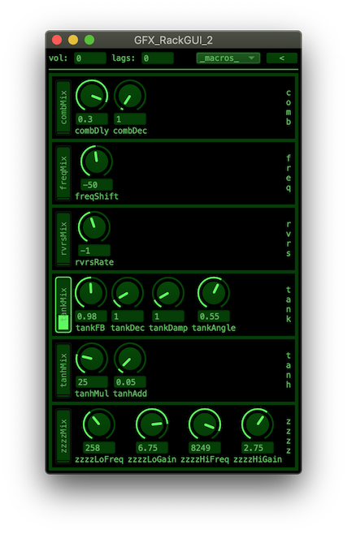
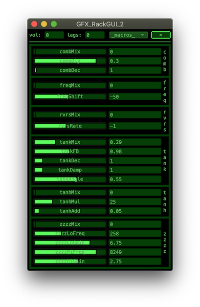
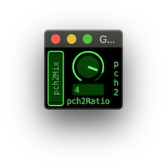
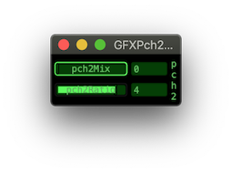
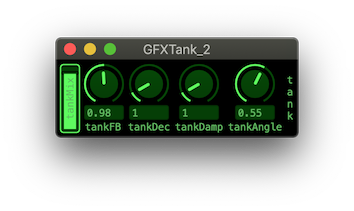
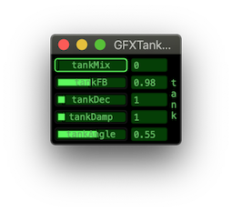

a [Quark](https://supercollider-quarks.github.io/quarks/) for [SuperCollider](https://supercollider.github.io)

# GFX

Green effects module system with optional GUI. Modules automatically adapt to any number of channels.

Based on the older redModule in the [redSys](https://github.com/redFrik/redSys) quark.

## Requirements

[SuperCollider](https://supercollider.github.io) version 3.9 or newer running under macOS, Linux or Windows.

## Dependancies

* **GUICV** - quark https://github.com/redFrik/GUICV

## Installation

```supercollider
//install
Quarks.install("https://github.com/redFrik/GFX")
//recompile
"Overviews/GFX_Overview".help
```

## Optional GUI

A GUI is provided. For effect modules it is generated dynamically, and the effects rack is stacking modules in a scrolling window.

There are a couple of different versions, and one can also set the look and feel by editing the skin (`GUI.skins.guiCV` provided by [GUICV](https://github.com/redFrik/GUICV))








